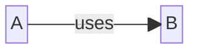

# Design

Provide an overview of the design aspect of {{cookiecutter.project_name}}.
Explain the key considerations and decisions made during the design
process. This section should give readers a clear understanding of the
design choices and the rationale behind them.

## Block Diagram

Include a block diagram that illustrates the high-level architecture of
{{cookiecutter.project_name}}. Identify the major components and their
connections. You can use tools like KiCAD's built-in schematic editor
to create the block diagram and export it as an image. In fact, using
multiple sheets can help both create a block diagram _and_ help structure
a larger project in a way that is more understandable. Other tools to use
include [OmniGraffle](https://www.omnigroup.com/omnigraffle) and
[draw.io](https://draw.io). Or, you can embed them in the documentation
using [MermaidJS](https://mermaid.js.org/syntax/block.html):

## Functional Requirements

List the functional requirements that {{cookiecutter.project_name}} 
aims to fulfill. These are specific features or capabilities that the 
project should provide to meet its intended purpose. You can read more on
[requirements](https://www.geeksforgeeks.org/functional-vs-non-functional-requirements/).

| ID | Functional Requirement                      |
|----|---------------------------------------------|
| 1  | Describe your first functional requirement. |

## Non-Functional Requirements

Outline the non-functional requirements for {{cookiecutter.project_name}}.
These requirements focus on qualities such as performance, reusability, 
reliability, usability, and maintainability.

| ID | Non-Functional Requirement                      |
|----|-------------------------------------------------|
| 1  | Describe your first non-functional requirement. |

## Design Decisions Log

Explain the important design decisions made during the development of
{{cookiecutter.project_name}} using a
[decision log](https://www.projectmanager.com/blog/project-decision-log).
Discuss the reasoning behind these decisions and how they impact the 
project. It can make sense to keep this in a CSV, or a separate
Markdown document depending on your needs. An example Markdown table is:

| ID | Category | Decision  | Impact                                                                         | Status  | Decided By | Date |
|----|----------|-----------|--------------------------------------------------------------------------------|---------|------------|------|
| 1  | Hardware | Use STM32 | This means that we are locked into the ecosystem, but we have to make a choice | Decided |{{ cookiecutter.github_username }}|   |
